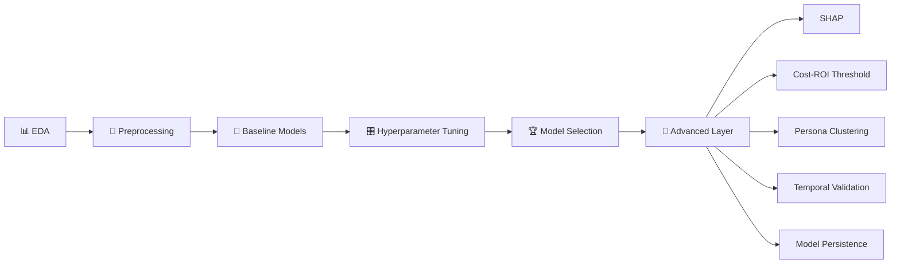

<div align="center">

# 📞 PreCall AI

### Cost-Aware Lead Scoring for Bank Term Deposit Campaigns

*Predicting who's worth calling — before a single call is placed.*

[](https://www.python.org/)
[](https://scikit-learn.org/)
[](https://xgboost.ai/)
[](https://lightgbm.readthedocs.io/)
[](https://shap.readthedocs.io/)
[](LICENSE)

</div>

---

## 🎯 The Problem

Bank call centers have limited agent hours. Historically, only **~11.3% of contacted customers** ever subscribe to a term deposit. Call everyone → most of that effort is wasted. Call randomly → wasted worse.

**PreCall AI** scores every customer *before* the call is dialed, ranks them by genuine subscription propensity, explains *why* each customer ranks where they do, and converts that ranking into projected dollars — not just a metric on a slide.

> Built on the [UCI Bank Marketing dataset](https://archive.ics.uci.edu/dataset/222/bank+marketing) — 41,188 real contacts from a Portuguese retail bank's 2008–2010 campaigns.

---

## 🛠️ Fail-Safe Notebook Deployment

> **Note to Reviewers:** GitHub's native notebook renderer frequently times out, breaks on complex cells, or displays an *"Unable to render"* error due to large data payloads and static SHAP/Seaborn visualization states. 

If the repository's `.ipynb` file fails to load directly within GitHub, please use one of the optimized external runtime environments below:

| Objective | Viewer Platform | Access Link |
| :--- | :--- | :--- |
| **Read Only** (Zero Load Latency) | **Jupyter nbviewer** | [👉 Launch Static Render](https://nbviewer.org/github/puravi-predicts/precall-ai/blob/main/precall_ai_pipeline.ipynb) |
| **Interactive** (Execute & Edit) | **Google Colab** | [👉 Open Live Sandbox](https://colab.research.google.com/github/puravi-predicts/precall-ai/blob/main/precall_ai_pipeline.ipynb) |

---

## ✨ What Sets This Apart

| | |
|---|---|
| 🔒 **Zero target leakage** | `duration` (call length) is dropped entirely — it's only known *after* the call ends, so keeping it would make the model fictionally accurate and practically useless |
| 🧠 **Explainable, not just accurate** | SHAP values explain both population-level drivers and individual customer decisions |
| 💰 **Real business framing** | Cost-sensitive ROI analysis finds the *profit-optimal* calling threshold, not the meaningless default of 0.5 |
| 📦 **Deployment-ready** | Full inference pipeline serialized into one bundle, with an end-to-end scoring function for raw, unprocessed input |
| ⏳ **Temporally validated** | Tested on a train-past/test-future split to confirm it survives the 2008 financial crisis the data spans, not just a lucky random split |
| 👥 **Segmentation included** | Unsupervised clustering surfaces customer personas independent of the model, for a marketing lens *alongside* propensity scoring |

---

## 🗺️ Pipeline Overview



<details>
<summary><b>📂 Click to expand full phase breakdown</b></summary>

| Phase | Contents |
|---|---|
| **1. EDA** | Distribution analysis, skew/outlier diagnostics, 8:1 class imbalance, correlation heatmap across demographic, behavioral & macroeconomic features |
| **2. Preprocessing** | IQR outlier capping, Yeo-Johnson power transform, one-hot encoding, `StandardScaler`, leakage-safe split, SMOTE |
| **3. Baseline Modeling** | Logistic Regression, Decision Tree, Random Forest, SVM, AdaBoost, Gradient Boosting, XGBoost, LightGBM, Keras ANN |
| **4. Hyperparameter Tuning** | GridSearchCV / RandomizedSearchCV on Random Forest, XGBoost, LightGBM |
| **5. Model Selection** | Best-model selection on test F1, feature importance, business recommendations |
| **6. Advanced Layer** | SHAP · cost-sensitive threshold tuning · ROC/PR overlay (12 models) · persona clustering · model persistence · temporal validation · calibration check · executive summary |

</details>

---

## 📊 Results

### Model Leaderboard (Test Set)

| Rank | Model | Accuracy | Precision | Recall | **F1** | ROC-AUC | PR-AUC |
|:---:|---|:---:|:---:|:---:|:---:|:---:|:---:|
| 🥇 | **LightGBM (Tuned)** | 0.876 | 0.473 | 0.567 | **0.516** | 0.799 | 0.492 |
| 🥈 | Random Forest (Tuned) | 0.861 | 0.430 | 0.602 | 0.502 | 0.801 | 0.490 |
| 🥉 | XGBoost (Tuned) | 0.853 | 0.414 | 0.618 | 0.496 | 0.803 | 0.496 |
| 4 | Gradient Boosting | 0.872 | 0.457 | 0.520 | 0.486 | 0.784 | 0.446 |
| 5 | LightGBM | 0.843 | 0.391 | 0.623 | 0.481 | 0.793 | 0.495 |
| 6 | XGBoost | 0.838 | 0.382 | 0.628 | 0.475 | 0.794 | 0.490 |
| 7 | Logistic Regression | 0.828 | 0.366 | 0.650 | 0.468 | 0.794 | 0.469 |
| 8 | SVM (RBF) | 0.855 | 0.407 | 0.525 | 0.458 | 0.756 | 0.386 |
| 9 | AdaBoost | 0.843 | 0.384 | 0.567 | 0.458 | 0.767 | 0.423 |
| 10 | Decision Tree | 0.807 | 0.323 | 0.595 | 0.418 | 0.743 | 0.418 |
| 11 | ANN (Keras MLP) | 0.874 | 0.450 | 0.376 | 0.410 | 0.760 | 0.391 |
| 12 | Random Forest | 0.893 | 0.577 | 0.299 | 0.394 | 0.772 | 0.435 |

> 🏆 **Winner: LightGBM (Tuned)** — selected on F1, since raw accuracy is a trap here: a model that always predicts "no" already scores ~88% on this imbalanced target.

<br>

### 💵 Business Impact

> Illustrative, directionally realistic assumptions: **$8 cost/call** · **$80 net margin/subscription**

| Strategy | Net Profit (Test Set) | Δ vs. Call-Everyone |
|---|:---:|:---:|
| Call everyone (no model) | baseline | — |
| Model @ default threshold (0.50) | higher | improved |
| **Model @ profit-optimal threshold (0.39)** | **+$24,400** | **best** |
| ↳ vs. default 0.50 threshold | | **+$2,016** |

The optimal threshold sits **below 0.5** — because a missed subscriber (lost $80 margin) costs more than a wasted call ($8). Plain accuracy or F1 can't see that asymmetry; the cost model can.

<br>

### 🔍 What Drives the Model (SHAP)

Mean |SHAP| ranking shows the model's decisions are dominated by:
1. **Macroeconomic conditions** (`euribor3m` is the single strongest driver, followed by `nr.employed` and `cons.price.idx`)
2. **Contact channel** (`contact_telephone`)
3. Customer-level features like `age` and `previous`, trailing well behind the macro signals

Interestingly, `poutcome` (prior campaign outcome) ranks high in plain split-count feature importance but **doesn't place in the SHAP top 15** — its frequency of use by tree splits doesn't translate into a comparably large *average* contribution to individual predictions. That divergence is itself a useful finding: split-count importance and SHAP importance can disagree, and SHAP is the more trustworthy signal for explaining individual decisions.

Both **global** (population-level) and **local** (single-customer) SHAP explanations are included — so every score is auditable, not a black box.

<br>

### ⏳ Robustness Check

Re-validated on a **temporal split** (train on the earlier campaign, test on the later campaign) instead of relying solely on a random split — which silently assumes customer behavior doesn't shift over time, even though this dataset spans the 2008 global financial crisis.

---

## 🛠️ Tech Stack

`pandas` `numpy` `scikit-learn` `XGBoost` `LightGBM` `imbalanced-learn (SMOTE)` `TensorFlow / Keras` `SHAP` `matplotlib` `seaborn`

---

## 📁 Repo Structure

```
.
├── precall_ai_pipeline.ipynb          # Full pipeline: EDA → preprocessing → modeling → tuning → advanced layer
├── bank_additional_full.csv           # UCI Bank Marketing dataset (41,188 rows)
├── model_artifacts/
│   └── bank_marketing_pipeline.joblib # Model + encoders + scaler + transformer + threshold, all in one file
├── requirements.txt
└── README.md
```

---

## 🚀 Quickstart

```bash
git clone https://github.com/puravi-predicts/precall-ai.git
cd precall-ai
pip install -r requirements.txt
jupyter notebook precall_ai_pipeline.ipynb
```

**Score a new customer end-to-end** (raw input → preprocessing → model, all inside one function). `predict_subscription()` is defined in Section 6.5 of the notebook and loads the saved bundle, so it can be run directly from the notebook or lifted into a standalone `inference.py` for API/batch deployment:

```python
import joblib
import pandas as pd

bundle = joblib.load('model_artifacts/bank_marketing_pipeline.joblib')
new_customer = pd.DataFrame([...])  # same raw schema as bank-additional-full.csv, minus 'y' and 'duration'
result = predict_subscription(new_customer)  # see Section 6.5 for the function definition
# -> subscription_probability, recommend_call
```

---

## 💡 Key Takeaway

A model is only as useful as the decision it drives. This project treats the 0.5 threshold, the accuracy score, and the feature-importance bar chart as **starting points, not endpoints** — and pushes through to the questions a real deployment actually demands:

> *Why does the model say what it says? What does it save the business? Does it survive changing conditions? And can someone other than the author run it?*

---

<div align="center">

*Dataset: S. Moro, P. Cortez, P. Rita. "A Data-Driven Approach to Predict the Success of Bank Telemarketing." Decision Support Systems, 2014.*

⭐ If this was useful, consider starring the repo

</div>
